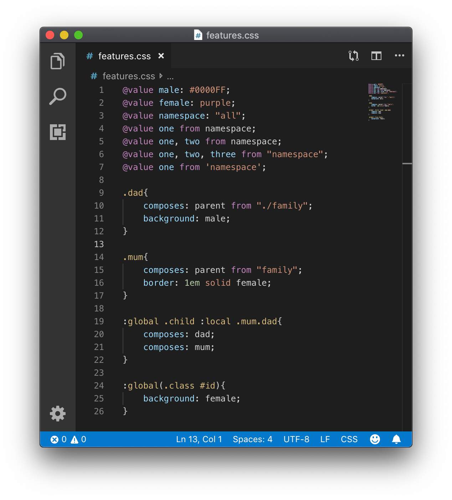

# vscode-css-modules

> An extension to add [CSS Modules](https://github.com/css-modules/css-modules) syntax highlighting to VSCode.

[![Visual Studio Marketplace][vscode-badge]][vscode-link]
[![Installs][installs-badge]][installs-link]
[![Downloads][downloads-badge]][downloads-link]

[![license MIT][license-badge]][license-link]
[![semantic-release][semantic-release-badge]][semantic-release-link]
[![commit style angular][commit-style-badge]][commit-style-link]
[![Greenkeeper badge][dependabot-badge]][dependabot-link]



## Features
Adds the following CSS Modules specific rule and attribute syntax highlighting on top of regular CSS/SCSS/SASS.
* `@value` variable decleration: regular and namespaced.
* `composes:` attribute: local and imports.
* `:global` pseudo class.
* `:local` pseudo class.

## Known Issues
Currently this extension only supports syntax highlighting. So errors may be thrown if you are using somesort of linter.
A suggested work-around is to add the following settings to your workspace:
```json
{
    "css.lint.validProperties": [
        "composes"
    ],
    "css.lint.unknownAtRules": "ignore",
    "scss.lint.validProperties": [
        "composes"
    ],
    "scss.lint.unknownAtRules": "ignore"
}
```

---
[CHANGELOG](./CHANGELOG.md) | [LICENSE][license-link]


[vscode-badge]: https://flat.badgen.net/vs-marketplace/v/andrewleedham.vscode-css-modules
[vscode-link]: https://marketplace.visualstudio.com/items?itemName=andrewleedham.vscode-css-modules

[installs-badge]: https://flat.badgen.net/vs-marketplace/i/andrewleedham.vscode-css-modules
[installs-link]: https://marketplace.visualstudio.com/items?itemName=andrewleedham.vscode-css-modules

[downloads-badge]: https://flat.badgen.net/vs-marketplace/d/andrewleedham.vscode-css-modules
[downloads-link]: https://marketplace.visualstudio.com/items?itemName=andrewleedham.vscode-css-modules

[license-badge]: https://flat.badgen.net/badge/license/MIT
[license-link]: ./LICENSE

[semantic-release-badge]: https://flat.badgen.net/badge/%20%20%F0%9F%93%A6%F0%9F%9A%80/semantic%20release/e10079
[semantic-release-link]: https://github.com/semantic-release/semantic-release

[commit-style-badge]: https://flat.badgen.net/badge/commit%20style/angular/purple
[commit-style-link]: https://github.com/angular/angular.js/blob/master/DEVELOPERS.md#-git-commit-guidelines

[dependabot-badge]: https://flat.badgen.net/dependabot/AndrewLeedham/vscode-css-modules?icon=dependabot
[dependabot-link]: https://dependabot.com
